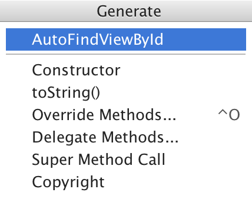
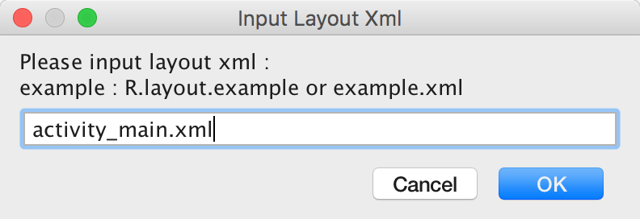
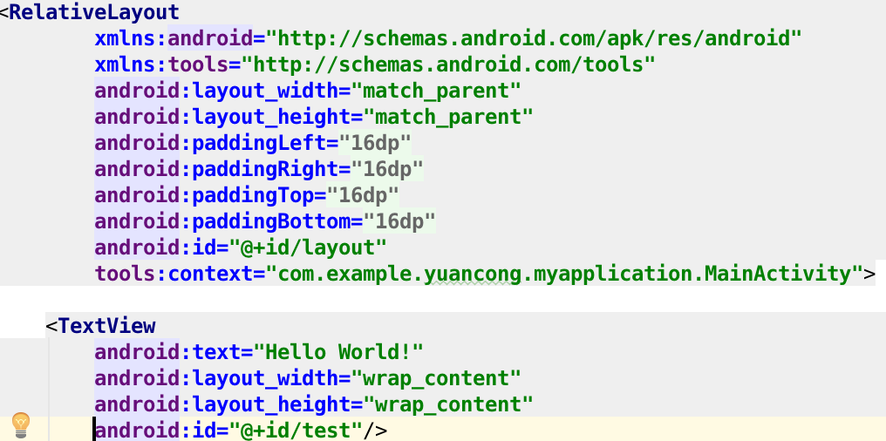
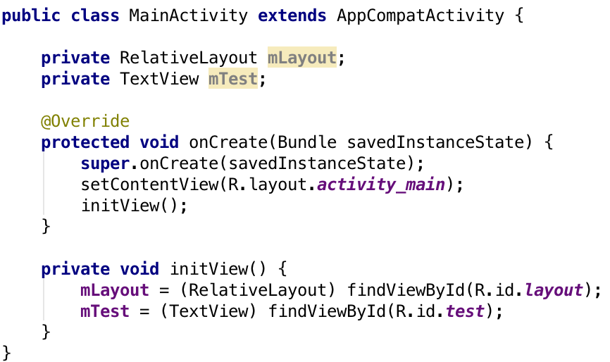

# AutoFindViewById
A quick way to generate findViewId codes automatically in Android

###插件说明
插件需要在JDK8以上才能安装使用，否则会报错。

安装以后在Activity或Fragment中右键或者快捷键调出generate菜单，选择AutoFindViewById，输入xml布局文件，确认即可。

结果对比：

XML布局文件：

最终生成的代码：

